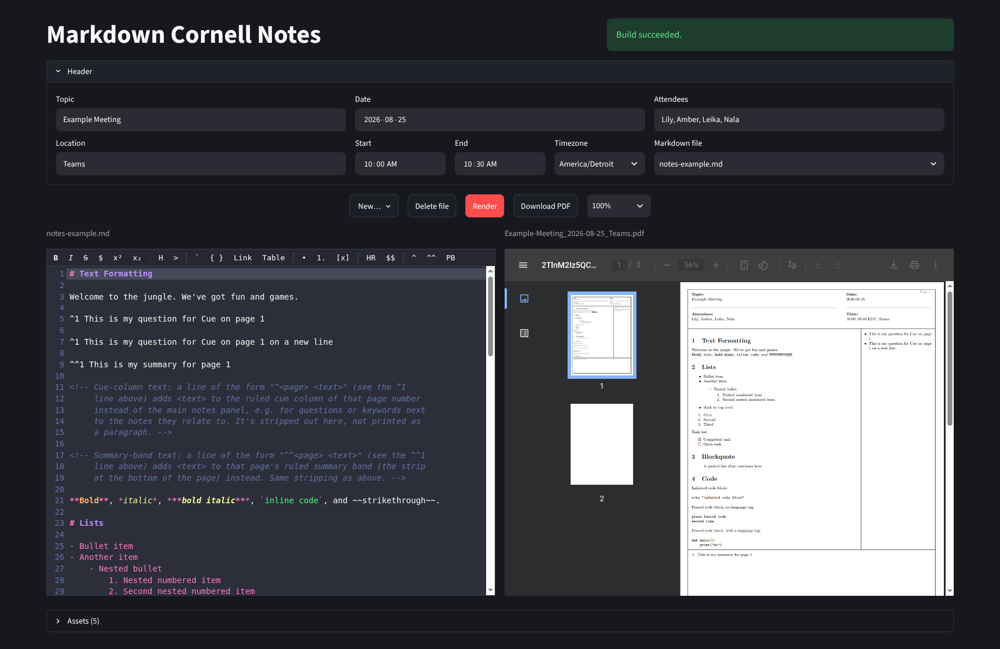
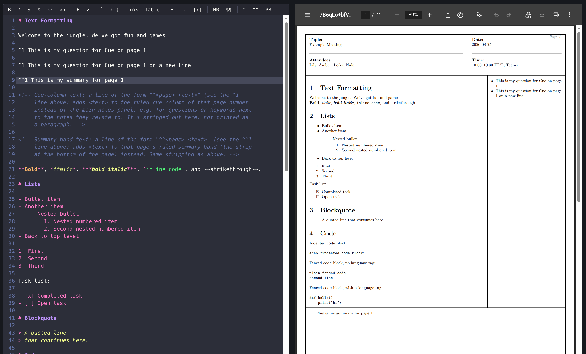

# Markdown Cornell Notes



---



A Cornell-style meeting notes template for LaTeX. Each page has a header
(topic, date, attendees, time), a large notes panel with a cue column
beside it, and a summary band below both, all blank for handwriting on
a printout.

Header details, notes content, and the page layout itself aren't edited in
the `.tex` file directly — they're generated from YAML and Markdown files,
so day-to-day use is just editing `yaml/notes.yaml` / `md/notes.md` /
`settings/page.yaml` and running `make`. The yaml file is paired with the
markdown file by name: `md/<stem>.md` goes with `yaml/<stem>.yaml`.


The page layout (notes panel, cue column, and summary band) follows the
Cornell Note-Taking System, developed by Walter Pauk at Cornell
University and first published in his book *How to Study in College*
(Houghton Mifflin, 1962). This LaTeX/Markdown build pipeline implementing
that layout was created by Todd Takala; it isn't affiliated with Cornell
University or the Pauk estate.

## Requirements

- A TeX Live (or similar) install with `pdflatex` and `latexmk`, plus the
  `tikz`, `xcolor`, `geometry`, `hyperref`, `amssymb`, `longtable`, and
  `booktabs` packages
- Python 3 (standard library only, no pip packages required, for `make
  build` itself — the optional [Streamlit editor app](#streamlit-editor-app)
  below needs `pip install -r requirements.txt`)
- [pandoc](https://pandoc.org/), for converting `md/notes.md` to LaTeX

## Quick start

```sh
make build
```

This regenerates the header, content, and page settings from
`yaml/notes.yaml` / `md/notes.md` / `settings/page.yaml`, compiles
`settings/template.tex`, and cleans up pdflatex's intermediate files
afterward. The result lands in `pdf/`, named after `yaml/notes.yaml`'s
`topic` and `date` fields (e.g. `pdf/Weekly-Sync_2026-08-23.pdf`) — see
[Naming the output PDF](#naming-the-output-pdf) below.

## Streamlit editor app

A browser UI for the whole pipeline above — edit the header fields and a
markdown file side by side with a rendered PDF, without touching the CLI.

```sh
pip install -r requirements.txt
make app
```

then open the URL `streamlit` prints (defaults to
[http://localhost:8501](http://localhost:8501)).

The page has a collapsible **Header** section (`topic`/`date`/`attendees`/
`time`) at the top. Location lives under Topic, and start/end time (12-hour,
with an AM/PM toggle) + a searchable IANA timezone dropdown live under Date,
all stacked below their respective field; the dropdown to switch between the
files in `md/` lives under Attendees. `date` is a calendar date picker, still stored in
`yaml/<stem>.yaml` as a plain `YYYY-MM-DD` string, same as editing it by
hand. The start/end/timezone group composes into the `time` field's usual
`"HH:MM--HH:MM"` string, now with the zone's abbreviation appended (e.g.
`"10:00--10:30 PDT"`); the dropdown's actual IANA zone name (e.g.
`"America/Los_Angeles"`) is stored separately in the `timezone` field, so
reopening a file restores the exact zone in the picker rather than just
the abbreviation. The Location field is stored directly in its own
`location` field rather than folded into `time` — `settings/template.tex`
recombines the two (as `"10:00--10:30 PDT, Zoom"`) when it typesets the
Time row, and `scripts/topic_slug.py` includes `location` in the output
PDF's filename (see [Naming the output PDF](#naming-the-output-pdf)).
Entries written before `timezone`/`location` existed, or hand-edited with
the old `"HH:MM--HH:MM TZ, location"` convention, still load into the
picker correctly — and get migrated to the two dedicated fields the next
time they're saved from the app.
The header form is per markdown file — each `md/<stem>.md` has its own
paired `yaml/<stem>.yaml`, so switching files in the dropdown also switches
the header fields shown, and creating a file creates a blank paired yaml
alongside it (deleting a file removes its yaml too).

Below the **Header** section is an **Assets** expander (labeled with the
current file count) that manages the `assets/` folder used for images and
linked documents (see [Images and linked documents](#images-and-linked-documents)
below): it lists each file with an image thumbnail (where applicable), a
copyable `assets/<name>` path to paste into your Markdown, and its size, plus
an uploader to add new files and a delete confirmation per file.

Below that, a centered row of **New file**/**Delete file** buttons (to
create or delete a file) sits next to **Render** and **Download PDF**.
Render saves both the selected file's header and its markdown content to
disk and runs `make build` for you, showing a success/failure message once
it's done. Download PDF (disabled until a PDF exists) downloads the current
one under its actual output filename. Below that, the markdown editor
(left) and the resulting PDF (right) sit side by side,
matched in height so their tops and bottoms align; switching files preserves
each file's unsaved edits for the rest of the session, though only Render
writes them to disk.

The editor itself is [CodeMirror](https://codemirror.net/), with syntax
highlighting for Markdown, inline/raw HTML, and fenced ` ```html `/
` ```latex ` code blocks, and — the reason it's CodeMirror rather than a
more typical embedded code-editor widget — real support for the browser's
own spellcheck: misspelled words get the usual squiggly underline, and
right-click → "Add to dictionary" uses the browser's own per-profile
dictionary, so it's remembered on future visits with no app-side state at
all. Its JS is vendored (`app/components/code_editor/frontend/bundle.js`)
rather than loaded from a CDN, so the app works offline; if you edit
`app/components/code_editor/frontend_src/editor.js`, rebuild it with:

```sh
cd app/components/code_editor/frontend_src
npm install
npm run build
```

### Formatting toolbar

A toolbar sits above the editor, grouped by kind:

- **Bold**, *italic*, ~~strikethrough~~, inline math (`$...$`), superscript,
  subscript — wrap the current selection (or a placeholder, if nothing's
  selected) in the matching Markdown syntax; the wrapped/placeholder text
  stays selected afterward so you can type straight over it.
- **Heading** — cycles the cursor's current line through `#` → `##` → `###`
  → no heading on repeated clicks.
- Quote, bullet list, numbered list, task list — toggle a per-line prefix
  (`> `, `- `, `1. `/`2. `/…, `- [ ] `) across every line the selection
  spans; clicking again on already-prefixed lines removes it.
- Inline code, fenced code block, Link, Table — code wraps like bold/italic
  above; Link inserts `[text](https://)` with the URL placeholder selected;
  Table inserts a 2-column pipe-table skeleton with its header placeholder
  selected.
- **HR**, display math (`$$...$$`) — insert a horizontal rule or a
  display-math line.
- **^**, **^^**, **PB** — insert a [cue-column](#cue-column-text) note, a
  [summary-band](#summary-band-text) note, or a
  [`<!-- pagebreak -->`](#pagination) directive on a new line right after
  the cursor's current line. `^`/`^^`'s page-number placeholder (defaulting
  to `1`) is pre-selected, so typing the real page number immediately
  overwrites it — the editor has no way to know which rendered PDF page the
  cursor's content will actually land on, since that's decided later by
  automatic pagination, so `1` is just as good a starting guess as any (and
  an out-of-range page number still renders on the nearest real page rather
  than vanishing, same as typing the directive by hand).

The toolbar's ~20 buttons wrap onto a second row if the editor pane isn't
wide enough to fit them all on one; the editor and PDF panes stay matched
in height either way.

### Autocompletion

The editor also offers three autocomplete sources, triggered by what you
type:

- Typing ` ``` ` at the start of a line suggests a fenced code-block
  language tag (`html`, `latex`/`tex`, `python`, `javascript`, `bash`,
  `json`, `yaml`, `text`). Only `html` and `latex`/`tex` get real syntax
  highlighting in the editor — and, like every fenced-code tag, none of
  them get highlighted in the built PDF either, since
  `scripts/markdown_to_pages.py` runs pandoc with `--no-highlight` — so the
  rest are just readable labels for the block's content, the same role
  `notes-example.md`'s own ` ```python ` block plays.
- Typing `](` inside a link or image target suggests filenames from
  `assets/` (as `assets/<name>`), so you don't have to remember exact
  names.
- Typing `/` at the start of a line or after whitespace (not mid-URL, so
  `https://` doesn't trigger it) offers snippet commands for everything the
  toolbar buttons above do (`/bold`, `/table`, `/task`, `/link`, `/image`,
  `/cue`, `/summary`, `/pagebreak`, etc.) — accepting one behaves exactly
  like clicking its toolbar button.

## Editing a page

- **`yaml/notes.yaml`** — the header fields (`topic`, `date`, `attendees`,
  `time`, `timezone`, `location`). Applied to every page automatically.
  Paired with its markdown file by name: `md/<stem>.md` goes with
  `yaml/<stem>.yaml`.
- **`md/notes.md`** — the notes panel content, written in Markdown.

```yaml
topic: Weekly Sync
date: 2026-08-23
attendees: Alice, Bob, Priya
time: "10:00--10:30"
timezone: "America/Los_Angeles"
location: "Zoom"
```

`timezone` and `location` are both optional. `timezone` is only meaningful
to the app's picker (see [Streamlit editor app](#streamlit-editor-app)) —
it holds the IANA zone name behind `time`'s abbreviation and isn't typeset
itself. `location` *is* typeset: `settings/template.tex` appends it to
`time` (as `"10:00--10:30, Zoom"`) on the Time row, and
`scripts/topic_slug.py` folds it into the output PDF's filename (see
[Naming the output PDF](#naming-the-output-pdf)).

```markdown
**Agenda**

- Status update on milestone 2
- Blockers from last sprint
- Next steps
```

Run `make build` again and both files flow through to the PDF.

> The `md/notes.md` shipped in this repo is currently a test file exercising
> the Markdown syntax this pipeline supports — formatting, lists, tables,
> code blocks, math, images, and so on — rather than real meeting
> content. Replace it with your own notes; until you do, it doubles as a
> working reference for what's supported (its HTML comments also note
> what isn't, and why).

### Pagination

The notes panel has a fixed height, so `md/notes.md` is measured and
automatically split across as many pages as it needs — you don't have to
plan page breaks by hand. If you want to force a break at a specific point
anyway (e.g. to start a new topic on its own page), put a line containing
only

```
<!-- pagebreak -->
```

between two sections.

### Cue-column text

A line of the form

```
^<page> <text>
```

e.g. `^1 This is my question for Cue`, adds `<text>` as a bullet point in
the cue column of that page number (the actual rendered PDF page,
matching the "Page N" printed in each page's header) instead of the main
notes panel — handy for questions or keywords next to the notes they
relate to. The directive line itself isn't printed. `<text>` goes through
the same Markdown/LaTeX pipeline as the main content, so it can use
inline formatting (`**bold**`, etc.); multiple entries targeting the same
page each become their own bullet, in document order.

### Summary-band text

A line of the form

```
^^<page> <text>
```

e.g. `^^1 This is my summary for page 1`, adds `<text>` as an item in an
ordered (numbered) list in that page's summary band — the strip at
the bottom of the page — instead of the main notes panel. The band is
split into two side-by-side columns: text starts in the left column,
word-wrapped to half the band's width, and if it's too long to fit, the
overflow continues at the top of the right column instead of running
past the band. Otherwise this behaves just like cue-column text: the
directive line isn't printed, and `<text>` goes through the same
Markdown/LaTeX pipeline as the main content.

The two directives are easy to tell apart even in shorthand: one caret
(`^1 ...`) is the cue column, two carets (`^^1 ...`) is the summary band.

`<page>` doesn't have to be a valid page number: anything below 1 (e.g.
`^0` or `^-3`) is clamped to page 1, and anything past the document's
actual last page (e.g. `^99` in a 3-page document) renders on that last
page instead — so a directive never silently vanishes just because the
page count changed or was miscounted.

### Multiple topics per document

`settings/template.tex` just does `\input{\cnBuildDir/cornell-content.tex}`,
which holds one `cornellFlow` environment per `md/notes.md` section.
(`\cnBuildDir` defaults to `build`, overridden per-invocation by the
Makefile's `BUILDDIR` — see `make build-example` below and the Streamlit
app's own scratch directory — so isolated builds actually compile their own
generated content instead of whatever's currently in the default `build/`.)
Every resulting page shares the same header from `yaml/notes.yaml` and
numbers itself automatically (top-right corner of the header box).

### Images and linked documents

Put images and any other files `md/notes.md` references in `assets/`, then
reference them with paths relative to the repo root:

```markdown


See the [reference notes](assets/reference-notes.txt) for background.
```

Images are auto-scaled to fit the notes panel width, so a full-resolution
screenshot won't overflow the page. Links are real, clickable PDF links
(via `hyperref`) — for a local file like the example above, a PDF viewer
resolves it relative to the output PDF's own location on disk, which is
`pdf/` rather than the repo root; `scripts/markdown_to_pages.py`
rewrites each relative link with a `../` prefix so it still resolves
correctly (web URLs are left untouched).

## Project structure

```
.
├── yaml/
│   └── notes.yaml        Header fields (source of truth). Paired with
│                         md/notes.md by filename stem -- see Editing a page
│                         above.
├── md/
│   └── notes.md          Notes panel content, in Markdown (source of
│                         truth).
├── assets/             Images & other files md/notes.md links to (source of
                        truth).
├── docs/
│   └── page-layout.drawio   Editable diagram source for the README's
│                            layout image (assets/page-layout.drawio.png);
│                            edit in draw.io/diagrams.net and re-export the
│                            PNG by hand.
├── settings/
│   ├── template.tex      Template + \cornellpage / \cornellFlow macros;
│   │                     \input's the generated files below and compiles
│   │                     to a PDF.
│   └── page.yaml         Page geometry & layout proportions (source of
│                         truth).
├── scripts/
│   ├── simple_yaml.py         Shared minimal YAML parser used by the
│   │                          scripts below.
│   ├── yaml_to_header.py      yaml/notes.yaml -> build/cornell-header.tex
│   ├── markdown_to_pages.py   md/notes.md (+pandoc) -> build/cornell-
│   │                          content.tex, build/cornell-cue.tex,
│   │                          build/cornell-summary.tex
│   ├── yaml_to_settings.py    settings/page.yaml -> build/cornell-page-
│   │                          settings.tex
│   └── topic_slug.py          yaml/notes.yaml's topic+date -> output PDF's
│                              filename
├── build/              Generated .tex fragments (gitignored, rebuilt by
                        make).
├── pdf/                Output PDF (see Naming the output PDF below).
├── app/
│   ├── streamlit_app.py  The Streamlit editor app; see Streamlit editor
│   │                     app above.
│   ├── pipeline.py       Header/markdown file I/O + `make build`
│   │                     invocation for the app.
│   └── components/
│       └── code_editor/      CodeMirror-based editor component
│                             (markdown/HTML/LaTeX highlighting + native
│                             browser spellcheck).
├── requirements.txt    Python deps for the app (`streamlit`); not needed for
                        `make build`.
└── Makefile            `make build` / `make app` / `make clean` / `make
                        distclean`.
```

Everything under `build/` is generated, not source — don't hand-edit those
files, and don't commit them (already gitignored). Each generator script
can also be run directly if you want to regenerate one file without the
others:

```sh
python3 scripts/yaml_to_header.py yaml/notes.yaml build/cornell-header.tex
python3 scripts/markdown_to_pages.py md/notes.md build/cornell-content.tex build/cornell-cue.tex build/cornell-summary.tex
python3 scripts/yaml_to_settings.py settings/page.yaml build/cornell-page-settings.tex
```

## Other Makefile targets

- `make build-example` — builds `md/notes-example.md` / `yaml/notes-example.yaml`
  instead of `md/notes.md` / `yaml/notes.yaml`, using its own `build/example/`
  scratch directory so it never collides with (or goes stale against) a
  regular `make build`. Useful for regenerating the reference PDF that
  demonstrates this pipeline's Markdown syntax without touching your own
  notes.
- `make app` — runs the [Streamlit editor app](#streamlit-editor-app).
- `make clean` — removes pdflatex's intermediate files, keeps the PDF.
- `make distclean` — also removes the generated `build/` files and the PDF.

## Customizing the layout

`settings/page.yaml` controls the page geometry and layout proportions —
no need to touch `settings/template.tex` itself:

```yaml
paper: letterpaper
margin: 0.25in

header_height: 0.12
cue_width: 0.25
summary_height: 0.18

padding: 0.12in
border_inset: 2pt
```

- **`paper`, `margin`** — passed straight to the LaTeX `geometry` package,
  so any value it accepts works (e.g. `paper: a4paper`, `margin: 20mm`).
- **`header_height`, `cue_width`, `summary_height`** — sizing for the
  header band, right-hand cue column, and the summary band at the bottom
  of the page, each as a plain decimal fraction of the drawable page
  height/width.
- **`padding`, `border_inset`** — inner text padding and the safety
  margin that keeps thick strokes inside the printable area, each a
  LaTeX length.

Edit the file and run `make build` again; every page picks up the change
automatically. Under the hood this generates
`build/cornell-page-settings.tex`, the same pattern as the header and
content files above.

## Naming the output PDF

The PDF is written to `pdf/` and named after `yaml/notes.yaml`'s `topic`,
`date`, and `location` fields, not a fixed `cornell-notes.pdf`.
`scripts/topic_slug.py` slugifies each field — collapsing any run of
characters that aren't safe in a filename (spaces, punctuation, ...) to a
single hyphen — and joins them with an underscore, so:

```yaml
topic: Weekly Sync
date: 2026-08-23
location: Zoom
```

produces `pdf/Weekly-Sync_2026-08-23_Zoom.pdf`. A blank/missing `location`
is dropped rather than leaving a trailing underscore, so entries without
one still produce `pdf/Weekly-Sync_2026-08-23.pdf` as before. Change
`topic`/`date`/`location` and run `make build` again to rename the output;
the previous PDF isn't deleted automatically.

## License

MIT — see [LICENSE](LICENSE).
