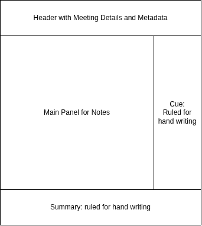

# Markdown Cornell Notes


*The optional [editor app](docs/editor-app.md) — a desktop app for writing
notes beside their PDF, with autosave, one-click rendering, an assets
explorer, and light and dark themes.*

A Cornell-style meeting notes template for LaTeX. Each page has a header
(topic, date, attendees, time), a large notes panel with a cue column
beside it, and a summary band below both, all blank for handwriting on
a printout.

Header details, notes content, and the page layout itself aren't edited in
the `.tex` file directly — they're generated from YAML and Markdown files,
so day-to-day use is just editing `yaml/notes.yaml` / `md/notes.md` /
`settings/page.yaml` and running `make`. The yaml file is paired with the
markdown file by name: `md/<stem>.md` goes with `yaml/<stem>.yaml`.



The page layout (notes panel, cue column, and summary band) follows the
Cornell Note-Taking System, developed by Walter Pauk at Cornell
University and first published in his book *How to Study in College*
(Houghton Mifflin, 1962). This LaTeX/Markdown build pipeline implementing
that layout was created by Todd Takala; it isn't affiliated with Cornell
University or the Pauk estate.

## Download

Ready-to-run editor apps, with everything needed to make PDFs built in:

- **Linux (64-bit Intel/AMD):** [AppImage, version 2.2.0](https://github.com/forloop11/markdown-cornell-notes/releases/tag/v2.2.0)
  — self-contained, nothing else to install. Needs a distribution with
  glibc 2.34 or later (Ubuntu 22.04, Debian 12, Fedora 35, or newer).
- **Debian 13+ (and Debian-based systems):** [.deb package, version 2.2.0](https://github.com/forloop11/markdown-cornell-notes/releases/tag/v2.2.0)
  — a small package of the command-line tool and the editor, using your
  system's own TeX Live and pandoc.
- **Fedora:** [RPM package, version 2.2.0](https://github.com/forloop11/markdown-cornell-notes/releases/tag/v2.2.0) — the same, as
  an RPM.
- **macOS 14+ on Apple silicon (M1 or later):** [macOS app, version 2.2.0 — test build](https://github.com/forloop11/markdown-cornell-notes/releases/tag/v2.2.0).
  It hasn't been run on a Mac yet and isn't notarized.
- **Windows 10/11 (64-bit):** [Windows installer, version 2.2.0 — test build](https://github.com/forloop11/markdown-cornell-notes/releases/tag/v2.2.0).
  It hasn't been run on Windows yet and isn't code-signed.

The [2.2.0 release notes](docs/release-notes/2.2.0.md) list what's new,
and say what to expect from the two test builds before trying them.

The release page has install steps. The apps aren't code-signed, so
Windows and macOS warn on first launch; the steps there explain what to
do.

To use the command line, or your system's own TeX Live and pandoc, see
[Quick start](#quick-start).

## Table of contents

- [Markdown Cornell Notes](#markdown-cornell-notes)
  - [Download](#download)
  - [Table of contents](#table-of-contents)
  - [Requirements](#requirements)
  - [Quick start](#quick-start)
  - [Using the editor app](#using-the-editor-app)
  - [Documentation](#documentation)
  - [Other Makefile targets](#other-makefile-targets)
  - [License](#license)

## Requirements

- A TeX Live (or similar) install with `pdflatex` and `latexmk`, plus the
  `tikz`, `xcolor`, `geometry`, `hyperref`, `amssymb`, `longtable`, and
  `booktabs` packages
- Python 3 (standard library only, no pip packages required)
- [pandoc](https://pandoc.org/), for converting `md/notes.md` to LaTeX
- For the optional [editor app](docs/editor-app.md) only:
  [PySide6](https://doc.qt.io/qtforpython-6/) (Qt for Python) 6.8 or later

To just use the editor, you can skip all of this: the
[downloadable apps](#download) for Windows, macOS, and Linux bundle it with
Python, Qt, pandoc, and TeX built in.

On Fedora, the build tools are one command away (PySide6 for the editor
app is installed separately, with pip — see [Quick start](#quick-start)):

```sh
sudo dnf install pandoc latexmk texlive-scheme-medium
```

On Debian/Ubuntu:

```sh
sudo apt install pandoc latexmk texlive-latex-extra
```

## Quick start

```sh
make build
```

This regenerates the header, content, and page settings from
`yaml/notes.yaml` / `md/notes.md` / `settings/page.yaml`, compiles
`settings/template.tex`, and cleans up pdflatex's intermediate files
afterward. The result lands in `pdf/`, named after `yaml/notes.yaml`'s
`topic`, `date`, and (if set) `location` fields (e.g.
`pdf/Weekly-Sync_2026-08-23_Zoom.pdf`) — see
[Naming the output PDF](docs/editing-notes.md#naming-the-output-pdf).

To customize the header fields and notes content, see
[Editing notes](docs/editing-notes.md), or use the
[editor app](docs/editor-app.md) — a desktop app over the same files, with
a live PDF preview:

```sh
python3 -m venv app/.venv                                # once: a place for PySide6...
app/.venv/bin/pip install -r app/requirements.txt        # ...and PySide6 itself
make app
```

`make app` opens the project in the current directory — in a checkout,
that's the repo itself, with its example notes.

## Using the editor app

The animation at the top of this page walks through a whole session. In
words:

1. **Fill in the details.** The **Details** section holds the header
   printed at the top of every page: topic, date, start and end time,
   timezone, location, and attendees. The date has a calendar, each time a
   picker (hours, and minutes in steps of five — or type any time), and
   the timezone a search-as-you-type list. Fold the section away to see a
   one-line summary instead and give the panes below more room.
2. **Write your notes** in Markdown in the editor on the left. Its toolbar
   and `/` shortcuts insert formatting for you; a line starting `^1` puts a
   note in page 1's cue column, and `^^1` in its summary band (see
   [Editing notes](docs/editing-notes.md)).
3. **Click Render** (Ctrl+R) to build the PDF, shown on the right. The
   preview keeps its zoom and place from one Render to the next, scrolls
   to follow the editor's cursor, and takes you to the matching line in
   the editor when you double-click text in it. It's
   saved in the project's `pdf/` folder, named after the topic, date, and
   location; **Download PDF** saves a copy anywhere else.
4. **Add images and other files** with the **assets explorer** down the
   left side, which shows the project's `assets/` folder: drag files in
   (or between folders), then double-click one to copy a link to it, e.g.
   ``, and paste that into your
   notes. Typing `](` in the editor also suggests asset paths. The red
   hamburger button at the left of the app bar hides and shows the
   explorer.

Everything saves as you type; there is no Save button. The editor and
preview size themselves to the window. Also:

- **Auto-render:** turn on *View > Auto-Render as You Type* and the PDF
  rebuilds itself a moment after you stop typing.
- **Deleting is recoverable:** deleted notes and assets go to the
  system's trash.
- **Renaming or moving an asset** offers to update the links to it in
  your notes.
- **Several notes:** the dropdown in the app bar switches between the
  project's notes; **+** makes a new one, the pencil renames one, and the
  trash button deletes one.
- **Find and replace** in the editor with Ctrl+F; the preview has its
  own search, and a button to open the PDF in your system's viewer to
  print it.
- **Help > Keyboard Shortcuts** (F1) lists the shortcuts.
- **File menu:** *Import Markdown File…* brings an existing `.md` file
  from anywhere on your computer into the project; *Export Markdown…* and
  *Export LaTeX…* save the open note as a `.md` or a single self-contained
  `.tex` file; *New Project…* sets up a fresh folder of notes wherever you
  choose, *Open Project Folder…* switches to an existing one, and *Open
  Recent* lists the ones you've used lately.
- **View menu:** *Appearance* switches between light, dark, and your
  desktop's setting; *Zoom Editor In/Out* changes the editor's text size.
- **Spellcheck** underlines misspellings in the editor, with suggestions
  on right-click. The AppImage and the Windows and macOS builds come with
  a US English dictionary; run any other way, add one as the
  [editor app](docs/editor-app.md) page describes.

## Documentation

- **[Editor app](docs/editor-app.md)** — the desktop app: importing
  existing Markdown files and exporting notes as Markdown or LaTeX; an app bar
  for switching files, rendering, and save/build status; an assets
  explorer; a collapsible note-details form; a Markdown editor with a
  formatting toolbar, autocompletion, and find and replace; and a PDF
  preview that keeps its place and follows the editor.
- **[Editing notes](docs/editing-notes.md)** — the `yaml`/`md` file format,
  pagination, cue-column and summary-band directives, multi-topic
  documents, linking assets, and how the output PDF is named.
- **[Project structure](docs/project-structure.md)** — what lives in each
  directory and how the build scripts fit together.
- **[Installation](docs/installation.md)** — installing as a `.deb` or RPM
  (and publishing the RPM through Fedora COPR), via Homebrew on macOS,
  with the Windows or macOS app or the Linux AppImage, as a snap, or
  running with Docker, instead of using a git checkout directly; and
  signing and notarizing the macOS app.
- **[Customizing the layout](docs/customization.md)** — page geometry and
  proportions via `settings/page.yaml`.

## Other Makefile targets

- `make build-example` — builds `md/notes-example.md` / `yaml/notes-example.yaml`
  instead of `md/notes.md` / `yaml/notes.yaml`, using its own `build/example/`
  scratch directory so it never collides with (or goes stale against) a
  regular `make build`. Useful for regenerating the reference PDF that
  demonstrates this pipeline's Markdown syntax without touching your own
  notes.
- `make app` — opens the [editor app](docs/editor-app.md) on the
  current directory's project (install PySide6 into `app/.venv` once
  first, as above).
- `make test` — runs the unit tests with pytest: `scripts/`, the app's
  backend, and — where PySide6 is installed — the app's window. Needs
  pytest: `app/.venv/bin/pip install -r requirements-dev.txt`.
- `make clean` — removes pdflatex's intermediate files, keeps the PDF.
- `make distclean` — also removes the generated `build/` files and the PDF.
- `make deb` — packages this project as a `.deb`; see
  [Installation](docs/installation.md#installing-as-a-system-package).
- `scripts/release.sh` — the steps of a release (`bump`, `build`,
  `publish`), so the version, the packages, their checksums, and the tag
  always line up; run it with no arguments for how.
- `make rpm` — packages it as an RPM for Fedora and RHEL-family systems;
  see [Installation](docs/installation.md#installing-on-fedora-and-rhel-family-systems-rpm),
  which also covers publishing it through Fedora COPR.
- `make windows` — builds the Windows installer for the editor app, with
  Python, Qt, pandoc, and TeX bundled; see
  [Installation](docs/installation.md#installing-on-windows).
- `make macos` — builds the editor app for Apple Silicon Macs as a zip,
  bundled the same way; see
  [Installation](docs/installation.md#installing-the-macos-app-apple-silicon).
- `make appimage` — builds the editor app for x86_64 Linux as a
  single-file AppImage, bundled the same way; see
  [Installation](docs/installation.md#running-the-linux-appimage).
- `make install-appimage` — installs that AppImage for you: into
  `~/Applications`, with an application-menu entry and icon.
  `make uninstall-appimage` removes it again.
- `make init` — scaffolds a fresh `md/`, `yaml/`, `settings/page.yaml`,
  `pdf/`, and `assets/` (with the `tux.jpg` the example note embeds) in the
  current directory from the bundled defaults. Only needed when using the
  installed `.deb` (a git checkout already has these); refuses to run if
  any of them already exist.

## License

MIT — see [LICENSE](LICENSE).
