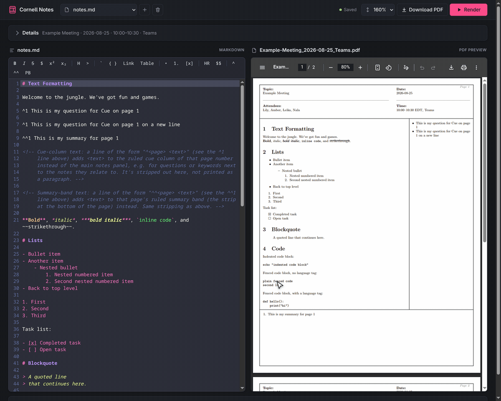
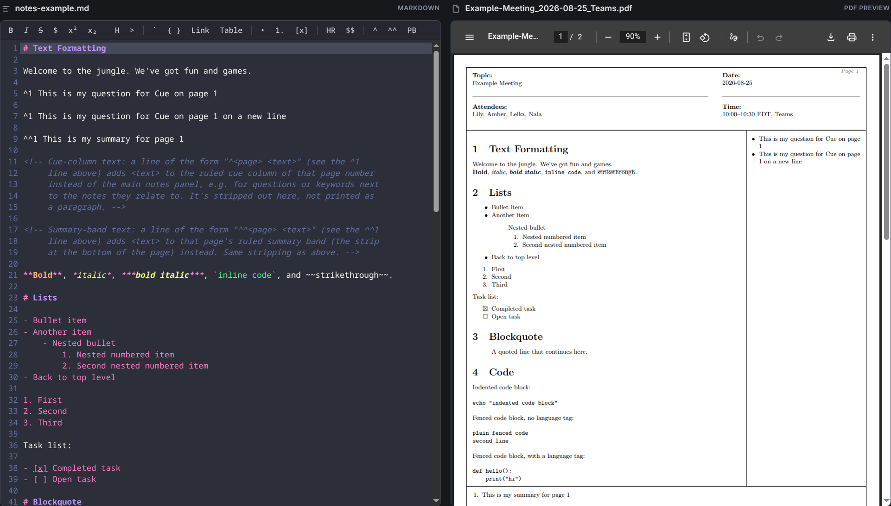

# Markdown Cornell Notes



---



*The optional [editor app](docs/editor-app.md) — a desktop app for editing
notes beside a live PDF preview, with autosave, one-click rendering, and
light and dark themes.*

A Cornell-style meeting notes template for LaTeX. Each page has a header
(topic, date, attendees, time), a large notes panel with a cue column
beside it, and a summary band below both, all blank for handwriting on
a printout.

Header details, notes content, and the page layout itself aren't edited in
the `.tex` file directly — they're generated from YAML and Markdown files,
so day-to-day use is just editing `yaml/notes.yaml` / `md/notes.md` /
`settings/page.yaml` and running `make`. The yaml file is paired with the
markdown file by name: `md/<stem>.md` goes with `yaml/<stem>.yaml`.


The page layout (notes panel, cue column, and summary band) follows the
Cornell Note-Taking System, developed by Walter Pauk at Cornell
University and first published in his book *How to Study in College*
(Houghton Mifflin, 1962). This LaTeX/Markdown build pipeline implementing
that layout was created by Todd Takala; it isn't affiliated with Cornell
University or the Pauk estate.

## Download

Ready-to-run editor apps, with everything needed to make PDFs built in:

- **Windows 10/11 (64-bit):** [Windows installer](https://github.com/forloop11/markdown-cornell-notes/releases/tag/v1.0.0)
- **macOS 13+ on Apple silicon (M1 or later):** [macOS app](https://github.com/forloop11/markdown-cornell-notes/releases/tag/v1.0.1)

Each release page has install steps. The apps aren't code-signed yet, so
Windows and macOS warn on first launch; the steps there explain how to
open them. Earlier and later versions are on the [Releases](https://github.com/forloop11/markdown-cornell-notes/releases) page.
On Linux, or to use the command line, see [Quick start](#quick-start).

## Table of contents

- [Markdown Cornell Notes](#markdown-cornell-notes)
  - [Download](#download)
  - [Table of contents](#table-of-contents)
  - [Requirements](#requirements)
  - [Quick start](#quick-start)
  - [Documentation](#documentation)
  - [Other Makefile targets](#other-makefile-targets)
  - [License](#license)

## Requirements

- A TeX Live (or similar) install with `pdflatex` and `latexmk`, plus the
  `tikz`, `xcolor`, `geometry`, `hyperref`, `amssymb`, `longtable`, and
  `booktabs` packages
- Python 3 (standard library only, no pip packages required)
- [pandoc](https://pandoc.org/), for converting `md/notes.md` to LaTeX
- For the optional [editor app](docs/editor-app.md) only:
  [Node.js](https://nodejs.org/) with npm

On Windows or an Apple Silicon Mac, you can skip all of this: the
[downloadable apps](#download) bundle the editor with Python, pandoc, and
TeX built in.

On Fedora, the build tools are one command away:

```sh
sudo dnf install pandoc latexmk texlive-scheme-medium nodejs npm
```

On Debian/Ubuntu:

```sh
sudo apt install pandoc latexmk texlive-latex-extra nodejs npm
```

## Quick start

```sh
make build
```

This regenerates the header, content, and page settings from
`yaml/notes.yaml` / `md/notes.md` / `settings/page.yaml`, compiles
`settings/template.tex`, and cleans up pdflatex's intermediate files
afterward. The result lands in `pdf/`, named after `yaml/notes.yaml`'s
`topic`, `date`, and (if set) `location` fields (e.g.
`pdf/Weekly-Sync_2026-08-23_Zoom.pdf`) — see
[Naming the output PDF](docs/editing-notes.md#naming-the-output-pdf).

To customize the header fields and notes content, see
[Editing notes](docs/editing-notes.md), or use the
[editor app](docs/editor-app.md) — a desktop app over the same files, with
a live PDF preview:

```sh
cd app && npm install && cd ..   # once, to fetch Electron
make app
```

## Documentation

- **[Editor app](docs/editor-app.md)** — the desktop app: an app bar
  for switching files, rendering, and save/build status; a collapsible
  note-details form; an assets manager; a Markdown editor with a
  formatting toolbar and autocompletion; and a live PDF preview.
- **[Editing notes](docs/editing-notes.md)** — the `yaml`/`md` file format,
  pagination, cue-column and summary-band directives, multi-topic
  documents, linking assets, and how the output PDF is named.
- **[Project structure](docs/project-structure.md)** — what lives in each
  directory and how the build scripts fit together.
- **[Installation](docs/installation.md)** — installing as a `.deb`, via
  Homebrew on macOS, with the Windows or macOS app, or running with Docker,
  instead of using a git checkout directly.
- **[Customizing the layout](docs/customization.md)** — page geometry and
  proportions via `settings/page.yaml`.

## Other Makefile targets

- `make build-example` — builds `md/notes-example.md` / `yaml/notes-example.yaml`
  instead of `md/notes.md` / `yaml/notes.yaml`, using its own `build/example/`
  scratch directory so it never collides with (or goes stale against) a
  regular `make build`. Useful for regenerating the reference PDF that
  demonstrates this pipeline's Markdown syntax without touching your own
  notes.
- `make app` — opens the [editor app](docs/editor-app.md) on the
  current directory's project (run `npm install` in `app/` once first).
- `make test` — runs the unit tests (pytest for `scripts/`, Node's test
  runner for `app/`).
- `make clean` — removes pdflatex's intermediate files, keeps the PDF.
- `make distclean` — also removes the generated `build/` files and the PDF.
- `make deb` — packages this project as a `.deb`; see
  [Installation](docs/installation.md#installing-as-a-system-package).
- `make windows` — builds the Windows installer for the editor app, with
  Python, pandoc, and TeX bundled; see
  [Installation](docs/installation.md#installing-on-windows).
- `make macos` — builds the editor app for Apple Silicon Macs as a zip,
  bundled the same way; see
  [Installation](docs/installation.md#installing-the-macos-app-apple-silicon).
- `make init` — scaffolds a fresh `md/`, `yaml/`, `settings/page.yaml`,
  `pdf/`, and `assets/` (with the `tux.jpg` the example note embeds) in the
  current directory from the bundled defaults. Only needed when using the
  installed `.deb` (a git checkout already has these); refuses to run if
  any of them already exist.

## License

MIT — see [LICENSE](LICENSE).
